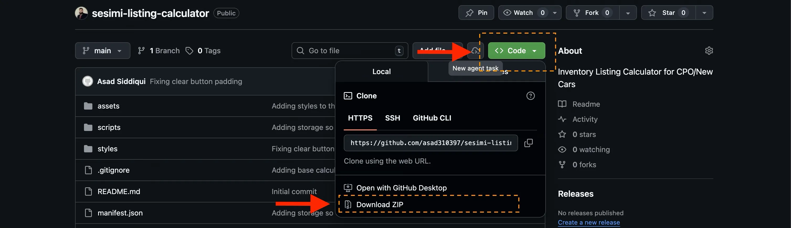
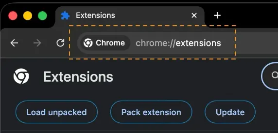
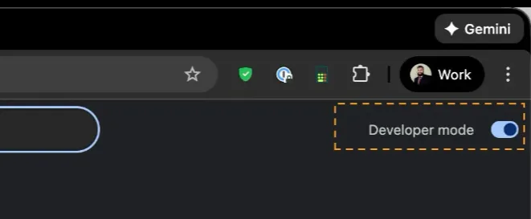
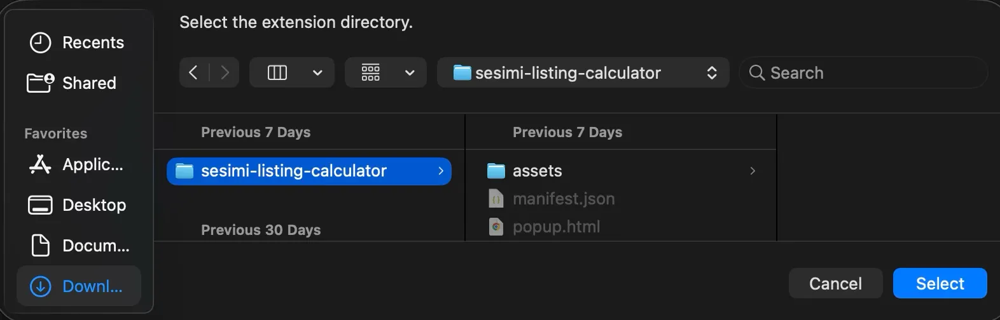

| Table of Contents                 |
| --------------------------------- |
| [How to use](#how-to-use)         |
| [How to set up](#how-to-set-up)   |
| [How to upgrade](#how-to-upgrade) |

# How to use

### Listing Calculator

Input:

- **Total Cars:** Add the number of all cars in the listing

- **New Cars:** The number of new cars eligible

- **CPO Cars:** The number of CPO cars eligible

- **Original ($):** The original amount in the claim

Output:

- **New Cars:** The portion of the original amount that’s applicable to the New Cars in the claim

- **CPO Cars:** The portion of the original amount that’s applicable to the CPO Cars in the claim

### Email Campaign Calculator

# How to set up

Navigate to:

https://github.com/asad310397/sesimi-listing-calculator

Navigate to Code > Download ZIP:

Then open chrome

Type in: chrome://extensions

Then turn on developer mode:

Then click on Load unpacked:

Finally select the sesimi-listing-calculator and hit “Select” and you should have it loaded

# How to upgrade

Delete the sesimi-listing-calculator folder from where you saved it. Then repeat the set-up instructions again
